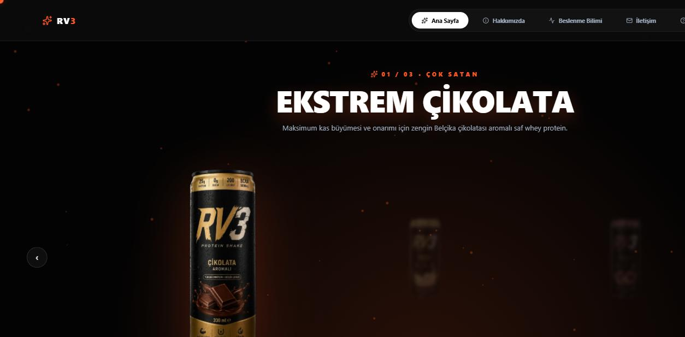
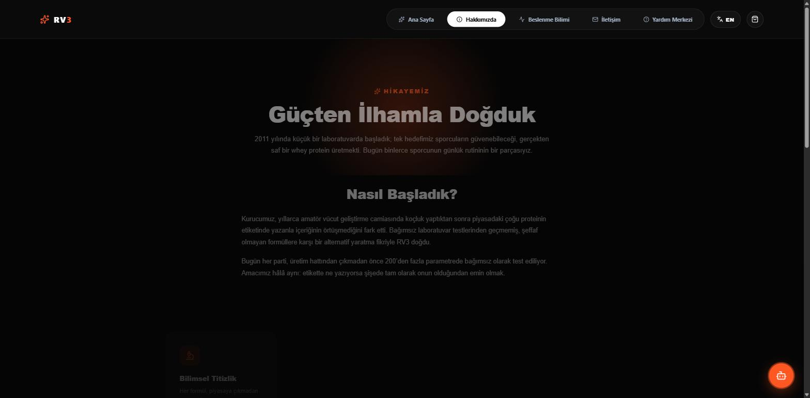

# RV3 — Pure Power, Pure Taste

<p align="right"><a href="./README.md">🇹🇷 Türkçe sürüm</a></p>

<p align="center">
  
</p>

<p align="center">
  
  
  
  
  
</p>

**RV3** is a fully front-end marketing/showcase site for a whey protein brand, presenting its products through an interactive 3D-style carousel. Built with React 19, TypeScript, and GSAP animations, it also ships a Claude-powered nutrition assistant, a frontend-only cart/checkout demo, and complete Turkish/English localization.

🔗 **Live demo:** [protein-3d-showcase.vercel.app](https://protein-3d-showcase.vercel.app/)

---

## ✨ Features

- 🧴 **Interactive product showcase** — a drag/swipe, arrow-key, and wheel-navigable carousel with a per-flavor color theme (`src/pages/HomePage.tsx`)
- 🎨 **GSAP animation layer** — a custom cursor, burst/particle effects (`BurstCanvas`), a canvas-based particle background, and a liquid drip effect
- 🤖 **AI Nutrition Assistant** — a fixed chat widget powered by the Anthropic Claude API; falls back to a keyword-matched mock reply mode when no API key is set
- 🧠 **3D robot mascot** — a lazy-loaded Spline scene that automatically degrades to a static icon on low-end devices or slow connections
- 🛒 **Cart + checkout demo** — a multi-step checkout flow with an animated, interactive credit card (a visual demo only — not wired to any real payment processor)
- 🌍 **Full TR/EN localization** — UI copy, flavor names/badges, and even the AI assistant all switch fully based on the selected language
- 📊 **Nutrition science page** — a daily protein needs calculator, a comparison table, and customer reviews
- 🏢 **About & Help Center pages** — brand story, certifications, and a categorized FAQ accordion
- ⚡ **Performance-minded** — route-level code splitting (`lazy` + `Suspense`), WebP-compressed product images, and heavy 3D content disabled on low-end devices/save-data connections

## 🖼️ Screenshots

| Home | About |
|---|---|
|  |  |

## 🧱 Tech Stack

| Layer | Technology |
|---|---|
| Framework | React 19 + TypeScript |
| Build tool | Vite 8 |
| Routing | react-router-dom 7 |
| Animation | GSAP 3 |
| 3D scene | Spline (`@splinetool/react-spline`) |
| Icons | lucide-react |
| AI assistant | `@anthropic-ai/sdk` (Claude), Vercel serverless function |
| Lint | oxlint |
| Deployment | Vercel (static SPA + one `api/` serverless function) |

## 🚀 Getting Started

```bash
git clone https://github.com/Rmzneren/protein-3d-showcase.git
cd protein-3d-showcase
npm install
npm run dev
```

The app runs at `http://localhost:5173` by default.

> ⚠️ Running the plain Vite dev server (`npm run dev`) alone will 404 on `/api/chat` (the AI assistant endpoint) — it's a Vercel serverless function. Use `vercel dev` or an actual deployment to test its real behavior. The widget still works without a key, falling back to rule-based mock replies.

### Environment variables

Copy `.env.example` to `.env`:

```bash
cp .env.example .env
```

| Variable | Required? | Description |
|---|---|---|
| `ANTHROPIC_API_KEY` | No | Lets the AI assistant give real Claude-generated answers. If left empty, `/api/chat` falls back to a keyword-matched mock reply — the widget still works. |

## 📜 Scripts

| Command | Description |
|---|---|
| `npm run dev` | Starts the Vite dev server with HMR |
| `npm run build` | Type-checks (`tsc -b`) then produces a production build |
| `npm run lint` | Runs oxlint |
| `npm run preview` | Serves the production build locally |
| `npm run typecheck:api` | Type-checks `api/` (Vercel serverless functions) separately — not run by `build` |
| `npm run optimize:images` | Compresses `public/images/*.png` to `.webp` via sharp |

There is no test suite/framework configured in this project.

## 📁 Project Structure

```
src/
├── App.tsx                # Sticky navbar, route definitions, global overlay components
├── main.tsx                # Mounts <App> inside BrowserRouter
├── context/                 # CartContext, LanguageContext
├── hooks/                    # useCart, useLanguage
├── i18n/                      # translations.ts — all TR/EN copy
├── data/flavors.ts              # Flavor data — single source of truth (also used server-side)
├── pages/                         # HomePage, AboutPage, NutritionPage, ContactPage, HelpPage
├── components/                     # AiAssistant, CartDrawer, CheckoutModal, AnimatedCreditCard,
│                                     ParticleBackground, BurstCanvas, LiquidDripCanvas, SplineRobot, Footer
└── utils/                            # deviceCapability.ts, scrollReveal.ts
api/
└── chat.ts                 # Vercel serverless function — Claude call + mock fallback
public/images/               # WebP-compressed product images
scripts/optimize-images.mjs   # PNG → WebP conversion script
```

## ⚠️ Important Note

This project is **purely a marketing/portfolio showcase**. The cart, checkout, and animated credit card flow are a visual demo only — nothing is wired to a real payment processor, and no information entered is ever sent anywhere or stored. If you need a real payment flow, integrate a licensed payment provider (Stripe, iyzico, etc.) yourself.

## 📄 License

This repository is a `private: true` personal/portfolio project with no explicit license — all rights reserved.
